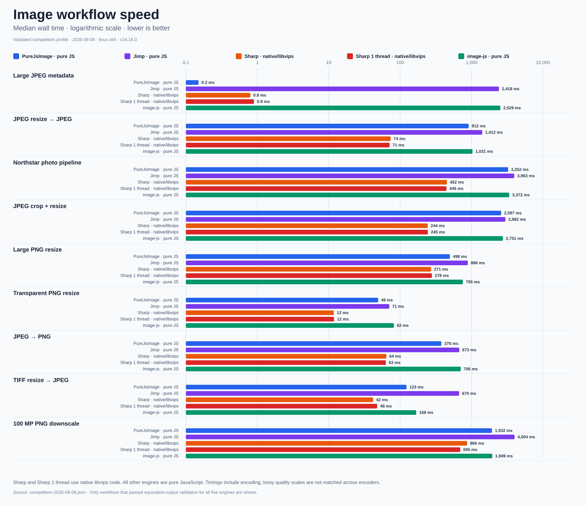
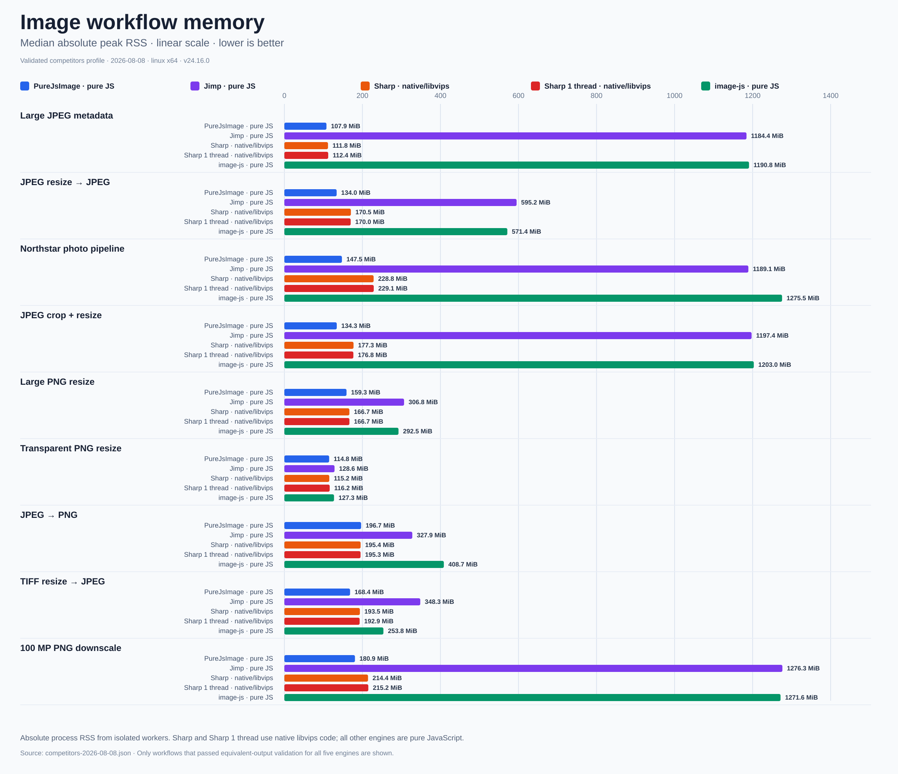

<div align="center">
<pre>
██████╗ ██╗   ██╗██████╗ ███████╗         ██╗███████╗
██╔══██╗██║   ██║██╔══██╗██╔════╝         ██║██╔════╝
██████╔╝██║   ██║██████╔╝█████╗           ██║███████╗
██╔═══╝ ██║   ██║██╔══██╗██╔══╝      ██   ██║╚════██║
██║     ╚██████╔╝██║  ██║███████╗     ╚█████╔╝███████║
╚═╝      ╚═════╝ ╚═╝  ╚═╝╚══════╝      ╚════╝ ╚══════╝
                         I M A G E
</pre>

<h3>Fast, low-memory image processing in pure TypeScript</h3>

<p>First-party codecs · zero runtime dependencies · built for Lambda and portable runtimes</p>

<p>
  <a href="https://www.npmjs.com/package/purejsimage"></a>
  <a href="https://github.com/a-r-d/PureJsImage/actions/workflows/ci.yml"></a>
  <a href="https://github.com/a-r-d/PureJsImage/blob/main/package.json"></a>
  <a href="https://www.npmjs.com/package/purejsimage"></a>
</p>

<p>
  <a href="https://github.com/a-r-d/PureJsImage/blob/main/package.json"></a>
  <a href="https://github.com/a-r-d/PureJsImage/blob/main/LICENSE"></a>
  <a href="https://github.com/a-r-d/PureJsImage"></a>
</p>

<p>
  <a href="https://a-r-d.github.io/PureJsImage/">Documentation</a> ·
  <a href="#install">Install</a> ·
  <a href="#usage">Usage</a> ·
  <a href="#supported-codecs">Codecs</a> ·
  <a href="ROADMAP.md">Roadmap</a> ·
  <a href="#benchmarks">Benchmarks</a>
</p>
</div>

PureJsImage is a dependency-free image processing library written in strict
TypeScript. It runs in Node.js and modern browsers and is designed to use much
less memory than image libraries that keep an entire source image in memory.

It includes first-party image codecs, has no runtime dependencies, and fails
clearly when a file or operation is not supported.

## Install

```sh
npm install purejsimage
```

PureJsImage requires Node.js 22 or newer. Browser applications use the
`purejsimage/browser` entry. Installing it adds no runtime dependencies, native
addons, external programs, or WebAssembly modules.

[Read the installation and browser guide →](https://a-r-d.github.io/PureJsImage/guides.html)

### Bundle size

Applications can import only the formats they need. These sizes use minified
production bundles from the current source:

| Entry | Minified | gzip | Brotli |
| --- | ---: | ---: | ---: |
| Core API | 36.9 KiB | 12.5 KiB | 11.1 KiB |
| Core + PNG | 64.1 KiB | 21.8 KiB | 19.1 KiB |
| Core + JPEG | 79.9 KiB | 26.9 KiB | 23.0 KiB |
| Core + JPEG 2000 | 72.7 KiB | 24.0 KiB | 21.0 KiB |
| Core + WebP | 86.3 KiB | 30.9 KiB | 26.6 KiB |
| Core + all codecs | 427.9 KiB | 144.7 KiB | 116.1 KiB |

[See bundle details and reproduction commands →](https://a-r-d.github.io/PureJsImage/performance.html#bundle)

## Usage

Register all supported formats, then build a processing pipeline:

```ts
import { createImageLibrary } from 'purejsimage'
import { allCodecs } from 'purejsimage/codecs/all'

const images = createImageLibrary(allCodecs)
const image = await images.open('input.jpg')

await image
  .autoOrient()
  .resize({ width: 1200, withoutEnlargement: true })
  .jpeg({ quality: 80, background: '#ffffff' })
  .toFile('output.jpg')
```

In a browser, import from `purejsimage/browser` and use `toBlob()` or
`toUint8Array()` for output.

Browser behavior is tested in Chromium, Firefox, and WebKit. See the
[browser compatibility report](browser-support.md) for exact versions,
coverage, and test commands.

[Read the API documentation and examples →](https://a-r-d.github.io/PureJsImage/api.html)

## Supported codecs

| Format | Read | Write |
| --- | --- | --- |
| JPEG | Yes | Yes |
| PNG | Yes | Yes |
| WebP | Yes | Yes |
| BMP | Yes | Yes |
| TIFF | Yes | Limited |
| GIF | First image | No |
| ICO | Yes | No |
| JPEG 2000 / JP2 | Limited | No |
| AVIF | Limited | No |
| HEIF / HEIC | Limited | No |

“Limited” means PureJsImage supports a useful subset and clearly rejects files
outside it.

[See the exact codec support matrix →](https://a-r-d.github.io/PureJsImage/codecs.html)

Detailed codec compatibility roadmaps:
[PNG](https://github.com/a-r-d/PureJsImage/blob/main/png-codec-support.md),
[JPEG](https://github.com/a-r-d/PureJsImage/blob/main/jpeg-codec-support.md),
[JPEG 2000](https://github.com/a-r-d/PureJsImage/blob/main/jpeg2000-codec-support.md),
[GIF](https://github.com/a-r-d/PureJsImage/blob/main/gif-codec-support.md),
[WebP](https://github.com/a-r-d/PureJsImage/blob/main/webp-codec-support.md),
[BMP](https://github.com/a-r-d/PureJsImage/blob/main/bmp-codec-support.md),
[ICO](https://github.com/a-r-d/PureJsImage/blob/main/ico-codec-support.md),
[TIFF](https://github.com/a-r-d/PureJsImage/blob/main/tiff-codec-support.md),
[AVIF](https://github.com/a-r-d/PureJsImage/blob/main/avif-codec-support.md), and
[HEIF / HEIC](https://github.com/a-r-d/PureJsImage/blob/main/heif-codec-support.md).

## Benchmarks

The competitor profile compares PureJsImage with Jimp, Sharp, Sharp configured
for one processing thread, and image-js. Sharp uses native libvips code; the
other engines shown here are pure JavaScript. Each library received the same
files and ran in a separate process. A result appears only when its output
passed validation.

[](benchmark/results/competitors-speed-2026-08-08.png)

[](benchmark/results/competitors-memory-2026-08-08.png)

On the 24-megapixel photo workflow, PureJsImage used 87.6% less peak memory
than Jimp and 88.4% less than image-js. Timing and memory vary by image,
operation, machine, and library version, so the full report includes the test
environment, compatibility results, and reproduction commands.

[See the complete benchmark report and methodology →](https://a-r-d.github.io/PureJsImage/performance.html)

## Why PureJsImage?

- Lower peak memory for common server and Lambda image workflows.
- No runtime dependencies, native addons, or external image programs.
- The same processing API in Node.js and modern browsers.
- Unsupported files and operations return clear errors instead of broken
  output.

[Read the practical guides →](https://a-r-d.github.io/PureJsImage/guides.html)

## Development

The repository uses TypeScript strict mode, Biome, and Vitest.

```sh
npm install
npm run check
```

[Read the contributor guide →](https://a-r-d.github.io/PureJsImage/contributing.html)

See [CONTRIBUTING.md](CONTRIBUTING.md) for the repository checklist and the
[project specification](project-spec.md) for the architecture and implementation
principles.

The detailed implementation and acceleration plans remain in the
[project roadmap](ROADMAP.md).
