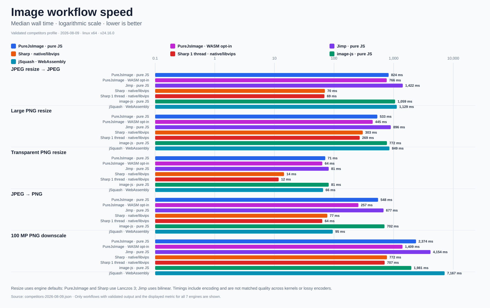
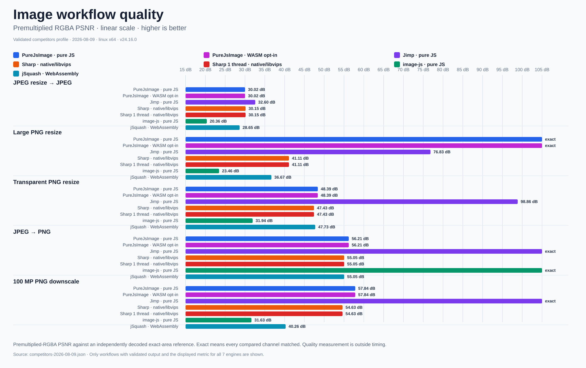

<div align="center">
<pre>
██████╗ ██╗   ██╗██████╗ ███████╗         ██╗███████╗
██╔══██╗██║   ██║██╔══██╗██╔════╝         ██║██╔════╝
██████╔╝██║   ██║██████╔╝█████╗           ██║███████╗
██╔═══╝ ██║   ██║██╔══██╗██╔══╝      ██   ██║╚════██║
██║     ╚██████╔╝██║  ██║███████╗     ╚█████╔╝███████║
╚═╝      ╚═════╝ ╚═╝  ╚═╝╚══════╝      ╚════╝ ╚══════╝
                         I M A G E
</pre>

<h3>Fast, low-memory image processing in pure TypeScript</h3>

<p>First-party codecs · zero runtime dependencies · built for Lambda and portable runtimes</p>

<p>
  <a href="https://www.npmjs.com/package/purejsimage"></a>
  <a href="https://github.com/a-r-d/PureJsImage/actions/workflows/ci.yml"></a>
  <a href="https://github.com/a-r-d/PureJsImage/blob/main/package.json"></a>
  <a href="https://www.npmjs.com/package/purejsimage"></a>
</p>

<p>
  <a href="https://github.com/a-r-d/PureJsImage/blob/main/package.json"></a>
  <a href="https://github.com/a-r-d/PureJsImage/blob/main/LICENSE"></a>
  <a href="https://github.com/a-r-d/PureJsImage"></a>
</p>

<p>
  <a href="https://a-r-d.github.io/PureJsImage/">Documentation</a> ·
  <a href="https://a-r-d.github.io/PureJsImage/demo.html"><strong>Live browser demo</strong></a> ·
  <a href="#install">Install</a> ·
  <a href="#usage">Usage</a> ·
  <a href="#supported-codecs">Codecs</a> ·
  <a href="ROADMAP.md">Roadmap</a> ·
  <a href="#benchmarks">Benchmarks</a>
</p>
</div>

PureJsImage is a dependency-free image processing library written in strict
TypeScript. It runs in Node.js and modern browsers and is designed to use much
less memory than image libraries that keep an entire source image in memory.

It includes first-party image codecs, has no runtime dependencies, and fails
clearly when a file or operation is not supported.

## Live browser demo

[Open the client-side image converter →](https://a-r-d.github.io/PureJsImage/demo.html)

Upload an image, let PureJsImage detect its actual format, apply optional
orientation, resize, rotation, and flip transforms, then download JPEG, PNG,
WebP, BMP, or TIFF output. The demo runs entirely in the browser, makes no
image-upload request, and reports conversion time plus the browser memory
measurements it can honestly observe.

## Install

```sh
npm install purejsimage
```

PureJsImage requires Node.js 22 or newer. Browser applications use the
`purejsimage/browser` entry. Installing it adds no runtime dependencies, native
addons, or external programs. The optional first-party JPEG and PNG accelerators
are separate WebAssembly entries and are never loaded by the root, browser, or
codec imports.

[Read the installation and browser guide →](https://a-r-d.github.io/PureJsImage/guides.html)

### Bundle size

JPEG and PNG form the matched set because all five libraries support them.
PureJsImage and jSquash can assemble only that set; the normal Jimp, image-js,
and Sharp imports include the additional codecs shown.

| Import | Version | Codecs included | Minified JS | gzip | Brotli |
| --- | --- | --- | ---: | ---: | ---: |
| **PureJsImage matched** | **0.7.0** | JPEG, PNG | 129.2 KiB | 42.1 KiB | 35.5 KiB |
| PureJsImage all codecs | 0.7.0 | 9 codecs | 501.6 KiB | 190.1 KiB | 160.1 KiB |
| Jimp | 1.6.0 | JPEG, PNG, TIFF, BMP, GIF | 577.4 KiB | 174.6 KiB | 139.5 KiB |
| image-js | 1.7.0 | JPEG, PNG, TIFF, BMP | 361.5 KiB | 111.2 KiB | 94.3 KiB |
| jSquash | JPEG 1.6.0; PNG 3.1.1; resize 2.1.1 | JPEG, PNG | **52.4 KiB** | **16.0 KiB** | **13.2 KiB** |
| Sharp JS wrapper | 0.35.3 | JPEG, PNG, TIFF, WebP, GIF, AVIF | 128.4 KiB | 38.3 KiB | 33.5 KiB |

Sharp's JavaScript bundle is only a wrapper around native code, while jSquash's
JavaScript bundle is glue around its WebAssembly codecs and resizer. The
complete installed deployment tells the other half of the story:

| Package | Version | Installed footprint | Production packages |
| --- | --- | ---: | ---: |
| **PureJsImage** | **0.7.0** | **1.7 MiB** | **1** |
| Jimp | 1.6.0 | 29.3 MiB | 70 |
| image-js | 1.7.0 | 17.0 MiB | 46 |
| jSquash JPEG + PNG + resize | JPEG 1.6.0; PNG 3.1.1; resize 2.1.1 | **1.0 MiB** | **3** |
| Sharp, including native libvips | 0.35.3 | 18.9 MiB | 6 |

[See bundle details and reproduction commands →](https://a-r-d.github.io/PureJsImage/performance.html#bundle)

## Usage

Register all supported formats, then build a processing pipeline:

```ts
import { createImageLibrary } from 'purejsimage'
import { allCodecs } from 'purejsimage/codecs/all'

const images = createImageLibrary(allCodecs)
const image = await images.open('input.jpg')

await image
  .autoOrient()
  .resize({ width: 1200, withoutEnlargement: true })
  .jpeg({ quality: 80, background: '#ffffff' })
  .toFile('output.jpg')
```

In a browser, import from `purejsimage/browser` and use `toBlob()` or
`toUint8Array()` for output.

### Optional WASM acceleration

JPEG and PNG have optional first-party WebAssembly accelerators. They are never
loaded unless you explicitly register them, and unsupported work continues to
use the default TypeScript codecs.

[See WASM setup, options, and supported workflows →](https://a-r-d.github.io/PureJsImage/api.html#wasm-acceleration)

## Supported codecs

<!-- capabilities:readme:start -->
| Format | Read | Write |
| --- | --- | --- |
| JPEG | Yes | Yes |
| PNG | Yes | Yes |
| WebP | Yes | Yes |
| BMP | Yes | Yes |
| TIFF | Yes | Limited |
| GIF | First image | No |
| ICO | Yes | No |
| JPEG 2000 / JP2 | Limited | No |
| AVIF | Limited | No |
| HEIF / HEIC (experimental) | Experimental | No |

“Limited” means PureJsImage supports a useful subset and clearly rejects files
outside it.
“Experimental” means the codec is excluded from `allCodecs` and requires an
explicit direct import and registration.

[See the exact codec support matrix →](https://a-r-d.github.io/PureJsImage/codecs.html)

Detailed codec compatibility roadmaps:
[JPEG](https://github.com/a-r-d/PureJsImage/blob/main/jpeg-codec-support.md),
[PNG](https://github.com/a-r-d/PureJsImage/blob/main/png-codec-support.md),
[WebP](https://github.com/a-r-d/PureJsImage/blob/main/webp-codec-support.md),
[BMP](https://github.com/a-r-d/PureJsImage/blob/main/bmp-codec-support.md),
[TIFF](https://github.com/a-r-d/PureJsImage/blob/main/tiff-codec-support.md),
[GIF](https://github.com/a-r-d/PureJsImage/blob/main/gif-codec-support.md),
[ICO](https://github.com/a-r-d/PureJsImage/blob/main/ico-codec-support.md),
[JPEG 2000 / JP2](https://github.com/a-r-d/PureJsImage/blob/main/jpeg2000-codec-support.md),
[AVIF](https://github.com/a-r-d/PureJsImage/blob/main/avif-codec-support.md),
and [HEIF / HEIC (experimental)](https://github.com/a-r-d/PureJsImage/blob/main/heif-codec-support.md).
<!-- capabilities:readme:end -->

HEIF/HEIC is experimental, excluded from `allCodecs`, and available only through
`purejsimage/codecs/experimental/heic`. Its [support contract](heif-codec-support.md)
includes the HEVC patent notice for users and distributors.

## Benchmarks

The seven-engine competitor profile measures the default PureJsImage TypeScript codecs and the
explicitly registered PureJsImage JPEG/PNG WASM accelerators as separate variants alongside Jimp,
Sharp, Sharp configured for one processing thread, image-js, and jSquash. Sharp uses native libvips;
PureJsImage WASM and jSquash use WebAssembly; default PureJsImage, Jimp, and image-js are pure
JavaScript. Each engine received the same files, used its public default resize kernel, and ran in a
separate process. A result appears only when its output passed validation.

[](benchmark/results/competitors-speed-2026-08-09.png)

[](benchmark/results/competitors-quality-2026-08-09.png)

[](benchmark/results/competitors-memory-2026-08-09.png)

Resize workflows use engine defaults: PureJsImage and Sharp use Lanczos 3 while
Jimp uses bilinear. The quality chart reports premultiplied-RGBA PSNR against an
independently decoded exact-area reference; `exact` means every visible color
and alpha channel matched. This exposes quality differences, but cross-kernel
timings remain default-experience measurements rather than matched-quality
comparisons.

Against the default TypeScript path, the opt-in WASM variant reduced median wall time by 53.2% for
JPEG-to-PNG, 40.7% for the 100-megapixel PNG downscale, and 16.4% for the large PNG resize while
returning the same measured output quality. On the 24-megapixel photo workflow, default PureJsImage
used 87.2% less peak memory than Jimp and 87.3% less than image-js. Timing, memory, and quality vary by
image, operation, machine, and library version, so the full report includes the test environment,
compatibility results, and reproduction commands.

[See the complete benchmark report and methodology →](https://a-r-d.github.io/PureJsImage/performance.html)

## Why PureJsImage?

- Lower peak memory for common server and Lambda image workflows.
- No runtime dependencies, required WebAssembly, native addons, or external image programs.
- The same processing API in Node.js and modern browsers.
- Unsupported files and operations return clear errors instead of broken
  output.

[Read the practical guides →](https://a-r-d.github.io/PureJsImage/guides.html)

## Development

The repository uses TypeScript strict mode, Biome, and Vitest.

```sh
npm install
npm run check
```

[Read the contributor guide →](https://a-r-d.github.io/PureJsImage/contributing.html)

See [CONTRIBUTING.md](CONTRIBUTING.md) for the repository checklist and the
[project specification](project-spec.md) for the architecture and implementation
principles.

The detailed implementation and acceleration plans remain in the
[project roadmap](ROADMAP.md).
