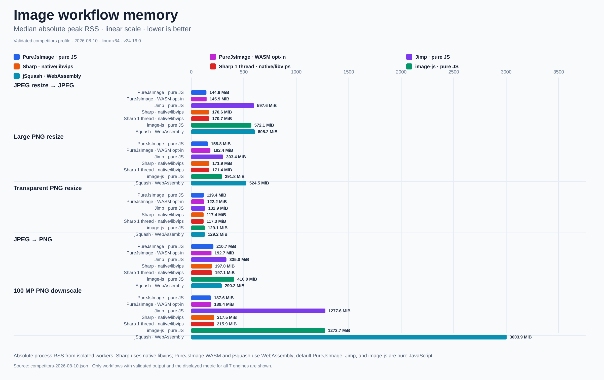

<div align="center">
<pre>
██████╗ ██╗   ██╗██████╗ ███████╗         ██╗███████╗
██╔══██╗██║   ██║██╔══██╗██╔════╝         ██║██╔════╝
██████╔╝██║   ██║██████╔╝█████╗           ██║███████╗
██╔═══╝ ██║   ██║██╔══██╗██╔══╝      ██   ██║╚════██║
██║     ╚██████╔╝██║  ██║███████╗     ╚█████╔╝███████║
╚═╝      ╚═════╝ ╚═╝  ╚═╝╚══════╝      ╚════╝ ╚══════╝
                         I M A G E
</pre>

<h3>Fast, low-memory image processing in pure TypeScript</h3>

<p>First-party codecs · zero runtime dependencies · built for Lambda and portable runtimes</p>

<p>
  <a href="https://www.npmjs.com/package/purejsimage"></a>
  <a href="https://github.com/a-r-d/PureJsImage/actions/workflows/ci.yml"></a>
  <a href="https://github.com/a-r-d/PureJsImage/blob/main/package.json"></a>
  <a href="https://www.npmjs.com/package/purejsimage"></a>
</p>

<p>
  <a href="https://github.com/a-r-d/PureJsImage/blob/main/package.json"></a>
  <a href="https://github.com/a-r-d/PureJsImage/blob/main/LICENSE"></a>
  <a href="https://github.com/a-r-d/PureJsImage"></a>
</p>

<p>
  <a href="https://a-r-d.github.io/PureJsImage/">Documentation</a> ·
  <a href="https://a-r-d.github.io/PureJsImage/demo.html"><strong>Live browser demo</strong></a> ·
  <a href="#install">Install</a> ·
  <a href="#usage">Usage</a> ·
  <a href="#supported-codecs">Codecs</a> ·
  <a href="ROADMAP.md">Roadmap</a> ·
  <a href="#benchmarks">Benchmarks</a>
</p>
</div>

PureJsImage is a dependency-free image processing library written in strict
TypeScript. It runs in Node.js and modern browsers and is designed to use much
less memory than image libraries that keep an entire source image in memory.

It includes first-party image codecs, has no runtime dependencies, and fails
clearly when a file or operation is not supported.

## Live browser demo

[Open the client-side image converter →](https://a-r-d.github.io/PureJsImage/demo.html)

Upload an image, let PureJsImage detect its actual format, apply optional
orientation, resize, rotation, and flip transforms, then download JPEG, PNG,
WebP, BMP, or TIFF output. The demo runs entirely in the browser, makes no
image-upload request, and reports conversion time plus the browser memory
measurements it can honestly observe.

## Install

```sh
npm install purejsimage
```

PureJsImage requires Node.js 22 or newer. Browser applications use the
`purejsimage/browser` entry. Installing it adds no runtime dependencies, native
addons, or external programs. The optional first-party JPEG and PNG accelerators
are separate WebAssembly entries and are never loaded by the root, browser, or
codec imports.

[Read the installation and browser guide →](https://a-r-d.github.io/PureJsImage/guides.html)

### Bundle size

JPEG and PNG form the matched set because all five libraries support them.
PureJsImage and jSquash can assemble only that set; the normal Jimp, image-js,
and Sharp imports include the additional codecs shown.

Measured on Linux x64 with Node.js 24.16.0 using the repository's reproducible
esbuild, gzip, and Brotli settings:

| Import | Version | Codecs included | Minified JS | gzip | Brotli |
| --- | --- | --- | ---: | ---: | ---: |
| **PureJsImage matched** | **0.8.0** | JPEG, PNG | 145.4 KiB | 47.2 KiB | 39.6 KiB |
| PureJsImage all codecs | 0.8.0 | 9 codecs | 668.9 KiB | 240.7 KiB | 201.6 KiB |
| Jimp | 1.6.0 | JPEG, PNG, TIFF, BMP, GIF | 577.4 KiB | 174.6 KiB | 139.5 KiB |
| image-js | 1.7.0 | JPEG, PNG, TIFF, BMP | 361.5 KiB | 111.2 KiB | 94.3 KiB |
| jSquash | JPEG 1.6.0; PNG 3.1.1; resize 2.1.1 | JPEG, PNG | **52.4 KiB** | **16.0 KiB** | **13.2 KiB** |
| Sharp JS wrapper | 0.35.3 | JPEG, PNG, TIFF, WebP, GIF, AVIF | 128.4 KiB | 38.3 KiB | 33.5 KiB |

Sharp's JavaScript bundle is only a wrapper around native code, while jSquash's
JavaScript bundle is glue around its WebAssembly codecs and resizer. The
complete installed deployment tells the other half of the story:

| Package | Version | Installed footprint | Production packages |
| --- | --- | ---: | ---: |
| **PureJsImage** | **0.8.0** | **2.3 MiB** | **1** |
| Jimp | 1.6.0 | 29.3 MiB | 70 |
| image-js | 1.7.0 | 17.0 MiB | 46 |
| jSquash JPEG + PNG + resize | JPEG 1.6.0; PNG 3.1.1; resize 2.1.1 | **1.0 MiB** | **3** |
| Sharp, including native libvips | 0.35.3 | 18.9 MiB | 6 |

[See bundle details and reproduction commands →](https://a-r-d.github.io/PureJsImage/performance.html#bundle)

## Usage

Register all supported formats, then build a processing pipeline:

```ts
import { createImageLibrary } from 'purejsimage'
import { allCodecs } from 'purejsimage/codecs/all'

const images = createImageLibrary(allCodecs)
const image = await images.open('input.jpg')

await image
  .autoOrient()
  .resize({ width: 1200, withoutEnlargement: true })
  .jpeg({ quality: 80, background: '#ffffff' })
  .toFile('output.jpg')
```

In a browser, import from `purejsimage/browser` and use `toBlob()` or
`toUint8Array()` for output.

### TIFF

TIFF support now spans display images, native scientific rasters, OME-TIFF,
whole-slide pyramids, extensible vendor profiles, and canonical RGB/RGBA output.
The complete support list, memory model, examples, and remaining boundaries live
on the dedicated TIFF page:

- [Complete TIFF support →](https://a-r-d.github.io/PureJsImage/tiff.html)
- [TIFF output options →](https://a-r-d.github.io/PureJsImage/tiff.html#encode)
- [Scientific TIFF and OME-TIFF →](https://a-r-d.github.io/PureJsImage/tiff.html#scientific)
  · [Third-party TIFF profiles →](https://a-r-d.github.io/PureJsImage/tiff.html#profiles)
- [Zstandard decompression API →](https://a-r-d.github.io/PureJsImage/api.html#zstandard)

### Optional WASM acceleration

JPEG and PNG have optional first-party WebAssembly accelerators. They are never
loaded unless you explicitly register them, and unsupported work continues to
use the default TypeScript codecs.

[See WASM setup, options, and supported workflows →](https://a-r-d.github.io/PureJsImage/api.html#wasm-acceleration)

## Supported codecs

<!-- capabilities:readme:start -->
| Format | Read | Write |
| --- | --- | --- |
| JPEG | Yes | Yes |
| PNG | Yes | Yes |
| WebP | Yes | Yes |
| BMP | Yes | Yes |
| TIFF | Yes | Yes |
| GIF | Static / explicit frame 0 | No |
| ICO | Yes | No |
| JPEG 2000 / JP2 | Limited | No |
| AVIF | Limited | No |
| HEIF / HEIC (experimental) | Experimental | No |

“Limited” means PureJsImage supports a useful subset and clearly rejects files
outside it.
“Experimental” means the codec is excluded from `allCodecs` and requires an
explicit direct import and registration.

[See the exact codec support matrix →](https://a-r-d.github.io/PureJsImage/codecs.html)

Detailed codec compatibility roadmaps:
[JPEG](https://github.com/a-r-d/PureJsImage/blob/main/jpeg-codec-support.md),
[PNG](https://github.com/a-r-d/PureJsImage/blob/main/png-codec-support.md),
[WebP](https://github.com/a-r-d/PureJsImage/blob/main/webp-codec-support.md),
[BMP](https://github.com/a-r-d/PureJsImage/blob/main/bmp-codec-support.md),
[TIFF](https://github.com/a-r-d/PureJsImage/blob/main/tiff-codec-support.md),
[GIF](https://github.com/a-r-d/PureJsImage/blob/main/gif-codec-support.md),
[ICO](https://github.com/a-r-d/PureJsImage/blob/main/ico-codec-support.md),
[JPEG 2000 / JP2](https://github.com/a-r-d/PureJsImage/blob/main/jpeg2000-codec-support.md),
[AVIF](https://github.com/a-r-d/PureJsImage/blob/main/avif-codec-support.md),
and [HEIF / HEIC (experimental)](https://github.com/a-r-d/PureJsImage/blob/main/heif-codec-support.md).
<!-- capabilities:readme:end -->

HEIF/HEIC is experimental, excluded from `allCodecs`, and available only through
`purejsimage/codecs/experimental/heic`. Its [support contract](heif-codec-support.md)
includes the HEVC patent notice for users and distributors.

<!-- library-comparison:readme:start -->
<!-- Generated by scripts/render-library-comparison.ts. Do not edit this block. -->
### TIFF library comparison

A capability is **Yes** only when upstream documentation or source supports it; measured decode coverage is reported separately against independent RGBA output. “Not verified” is not treated as unsupported.

| Library | Runtime model | Browser | BigTIFF | Tiles | Region decode | Native scientific raster | OME / whole-slide semantics | Decode coverage |
| --- | --- | --- | --- | --- | --- | --- | --- | --- |
| PureJsImage main snapshot · unreleased · 3868385 | Pure JavaScript | Yes | Yes | Yes | Yes | Yes | Yes | 104/106 decoded<br>57 exact<br>2 oracle failures |
| GeoTIFF.js 3.0.5 | Pure JavaScript | Yes | Partial | Yes | Yes | Yes | No | 84/106 decoded<br>32 exact<br>11 unsupported · 7 errors · 2 oracle failures · 2 crashes |
| UTIF.js (utif2) 4.1.0 | Pure JavaScript | Yes | No | Yes | No | Partial | No | 74/106 decoded<br>49 exact<br>28 errors · 2 oracle failures · 2 timeouts · 3 crashes |
| image-js/tiff 7.1.3 | Pure JavaScript | Yes | No | Yes | No | Yes | No | 41/106 decoded<br>27 exact<br>51 unsupported · 12 errors · 2 oracle failures |
| image-js 1.7.0 | Pure JavaScript | Yes | No | Yes | No | Partial | No | 39/106 decoded<br>33 exact<br>51 unsupported · 14 errors · 2 oracle failures |
| Jimp 1.6.0 | Pure JavaScript | Yes | No | Yes | No | No | No | 74/106 decoded<br>49 exact<br>28 errors · 2 oracle failures · 2 timeouts · 3 crashes |
| Sharp / libvips 0.35.3 | Native wrapper | No | Partial | Yes | Partial | Partial | No | Not run |

[Full grouped capability matrix, methods, sources, and per-library results](https://a-r-d.github.io/PureJsImage/tiff-comparison.html)
<!-- library-comparison:readme:end -->

## Benchmarks

The seven-engine competitor profile measures the default PureJsImage TypeScript codecs and the
explicitly registered PureJsImage JPEG/PNG WASM accelerators as separate variants alongside Jimp,
Sharp, Sharp configured for one processing thread, image-js, and jSquash. Sharp uses native libvips;
PureJsImage WASM and jSquash use WebAssembly; default PureJsImage, Jimp, and image-js are pure
JavaScript. Each engine received the same files, used its public default resize kernel, and ran in a
separate process. A result appears only when its output passed validation.

[](benchmark/results/competitors-speed-2026-08-10.png)

[](benchmark/results/competitors-quality-2026-08-10.png)

[](benchmark/results/competitors-memory-2026-08-10.png)

Resize workflows use engine defaults: PureJsImage and Sharp use Lanczos 3 while
Jimp uses bilinear. The quality chart reports premultiplied-RGBA PSNR against an
independently decoded exact-area reference; `exact` means every visible color
and alpha channel matched. This exposes quality differences, but cross-kernel
timings remain default-experience measurements rather than matched-quality
comparisons.

The August 10 profile used PureJsImage 0.8.0 on Node.js 24.16.0. Against the default TypeScript path,
the opt-in WASM variant reduced median wall time by 53.0% for JPEG-to-PNG, 38.9% for the
100-megapixel PNG downscale, and 11.6% for the large PNG resize while returning the same measured
output quality. On the 24-megapixel photo workflow, default PureJsImage used 86.7% less peak memory
than Jimp and 87.6% less than image-js. Timing, memory, and quality vary by image, operation,
machine, and library version.

The focused nine-run TIFF profile recorded:

| Workflow | PureJsImage wall | PureJsImage RSS | Jimp wall | Jimp RSS |
| --- | ---: | ---: | ---: | ---: |
| 4000×3000 TIFF metadata | 0.4 ms | 134.4 MiB | 150.4 ms | 289.8 MiB |
| 4000×3000 TIFF → 1000px JPEG | 144.4 ms | 214.9 MiB | 663.0 ms | 372.1 MiB |
| 7795×3122 LZW TIFF → 1000px PNG | 1,026.2 ms | 133.0 MiB | 753.2 ms | 284.8 MiB |
| PNG → Deflate TIFF | 24.5 ms | 111.4 MiB | 97.3 ms | 152.8 MiB |

PureJsImage passed all 18 TIFF workflows. Jimp passed seven, lacked the eight bounded raw/region
workflows, and produced invalid pixels in three decode-to-PNG cases. The LZW row is the measured
exception to the speed advantage: PureJsImage was slower there but used 53.3% less peak RSS.

[Raw competitor report](benchmark/results/competitors-2026-08-10.md) ·
[PureJsImage TIFF report](benchmark/results/tiff-profile-2026-08-10.md) ·
[Jimp TIFF report](benchmark/results/jimp-tiff-profile-2026-08-10.md)

[See the complete benchmark report and methodology →](https://a-r-d.github.io/PureJsImage/performance.html)

### Lambda memory sizing

A 256 MiB Lambda completed every measured 12-megapixel resize/conversion workflow and used
121–156 MiB at peak. That does not make 256 MiB the fastest setting: Lambda also allocates CPU with
memory. For JPEG → WebP, warm operation time fell from 10,601 ms at 256 MiB to 5,261 ms at 512 MiB
and 2,533 ms at 1024 MiB, while peak use stayed at 120–122 MiB. For latency-sensitive endpoints,
start at 1024 MiB even when the process only consumes about 150 MiB; use 256 MiB when its lower CPU
allocation and roughly 10-second latency are acceptable. Re-measure with your own images and
concurrency.

## Why PureJsImage?

- Lower peak memory for common server and Lambda image workflows.
- No runtime dependencies, required WebAssembly, native addons, or external image programs.
- The same processing API in Node.js and modern browsers.
- Unsupported files and operations return clear errors instead of broken
  output.

### When to use Sharp instead

If you can deploy native libvips and throughput or latency is the main constraint, use
[Sharp](https://sharp.pixelplumbing.com/). It was 1.9×–12.2× faster than the default TypeScript path
across the five commonly supported benchmark workflows. PureJsImage is the better fit when the same
code must run in Node.js and browsers or edge workers, native addons or WASM are prohibited, or a
zero-dependency deployment materially simplifies an air-gapped or supply-chain-restricted build.
The measured installed footprint was 2.3 MiB and one package for PureJsImage versus 18.9 MiB and six
production packages for Sharp.

[Read the practical guides →](https://a-r-d.github.io/PureJsImage/guides.html)

## Development

The repository uses TypeScript strict mode, Biome, and Vitest.

```sh
npm install
npm run check
```

[Read the contributor guide →](https://a-r-d.github.io/PureJsImage/contributing.html)

See [CONTRIBUTING.md](CONTRIBUTING.md) for the repository checklist and the
[project specification](project-spec.md) for the architecture and implementation
principles.

The detailed implementation and acceleration plans remain in the
[project roadmap](ROADMAP.md).
