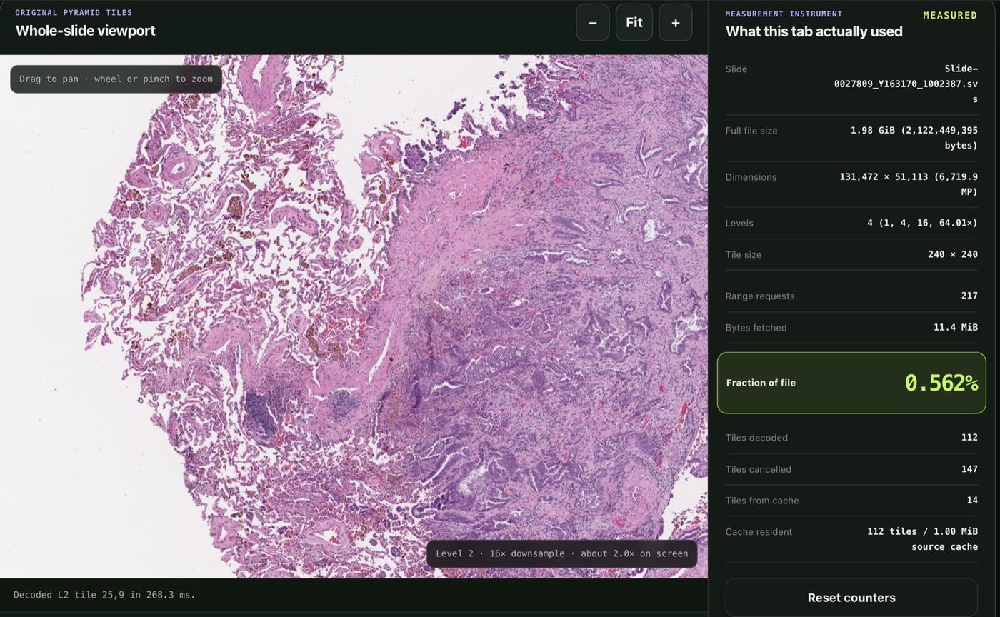
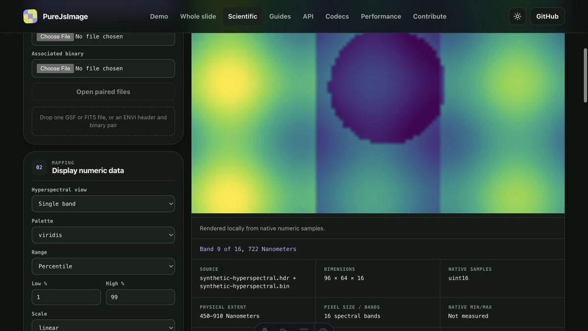
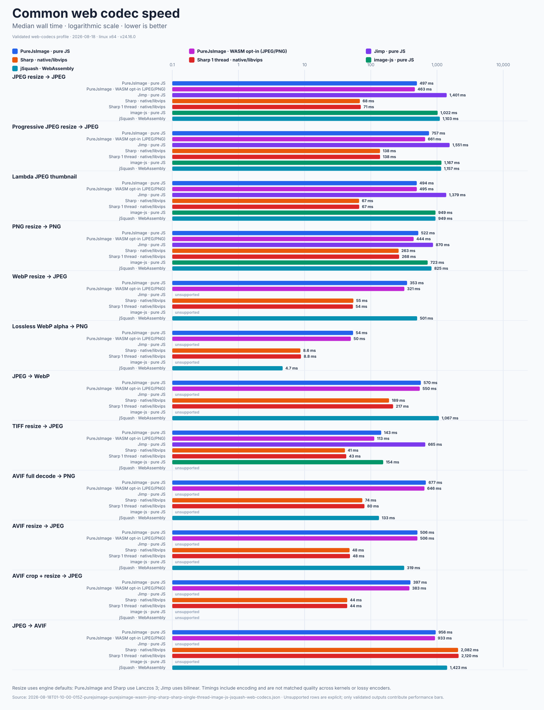
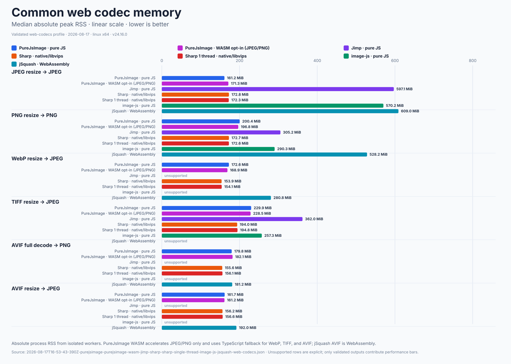

<div align="center">


<h1>PureJsImage</h1>

<p><strong font-size="font-size: 20px">Zero-runtime-dependency image processing in strict TypeScript</strong></p>

<p>Portable image codecs · native scientific rasters · optional explicit WASM acceleration</p>

<p>
  <a href="https://www.npmjs.com/package/purejsimage"></a>
  <a href="https://github.com/a-r-d/PureJsImage/actions/workflows/ci.yml"></a>
  <a href="https://github.com/a-r-d/PureJsImage/blob/main/package.json"></a>
  <a href="https://github.com/a-r-d/PureJsImage/blob/main/LICENSE"></a>
</p>

<p>
  <a href="https://purejsimage.com/">Documentation</a> ·
  <a href="https://purejsimage.com/demo/"><strong>Image demo</strong></a> ·
  <a href="https://purejsimage.com/scientific/"><strong>Scientific explorer</strong></a> ·
  <a href="https://purejsimage.com/wsi/"><strong>Whole-slide demo</strong></a> ·
  <a href="https://lab.purejsimage.com/"><strong>PureJsImage Lab</strong></a>
</p>

<p >
  <blockquote style="font-size:20px;">Sometimes the wrong tool for the job is the right one 😉</blockquote>
</p>
</div>

<p align="center">
  <a href="https://purejsimage.com/wsi/">
    
  </a>
</p>
<p align="center"><em>Measured HTTP Range session from the live browser viewer: only the visible pyramid tiles were read.</em></p>

## What PureJsImage is best at

- **Low peak memory usage** - bounded rows, scanlines, strips, and tiles avoid source-sized RGBA working sets where formats permit it.
- **Portable across Node.js and modern browsers** - strict TypeScript runs without native addons or system executables.
- **Zero dependencies** - the published package has no runtime dependency tree. You can also easily tree-shake our exports.
- **Native scientific raster processing** - direct-range reads and native-precision data avoid forcing scientific samples through RGBA.
- **Correctness-gated benchmarks** - ordinary codec and scientific-reader suites measure speed, peak RSS, output validity, source I/O, and package footprint.
- **Optional WASM accelerators** - explicit JPEG and PNG accelerator imports never load or activate automatically.
- **HUGE tested compatibility matrix** - we used Imazen image corpus ensure massive breadth of compatibility. PureJsImage can process many more image format variations successfully than nearly every competing project.
- **Benchmaxxed performance** - we painstakingly hillclimbed performance metrics vs other JS image libraries. Most of the hot loops have been unrolled. We are still slower than Sharp but mostly faster than anything else that is pure JS.

PureJsImage provides portable image codecs and low-memory raster workflows for Node.js
and modern browsers. The permanent reference engine is strict TypeScript with no runtime dependency
tree, native addon, system executable, or implicit WebAssembly download. Optional JPEG
and PNG WASM accelerators use separate imports and explicit registration.

Low memory is a primary product requirement. PureJsImage exists to avoid the source-sized RGBA
working sets that make common JavaScript image pipelines expensive or unsafe in constrained
environments such as AWS Lambda. Codecs push crops and resize toward decode, retain bounded rows or
tiles where their structure permits it, and label full-frame fallbacks explicitly.

<!-- documentation:summary:start -->
<!-- Generated by scripts/render-documentation.ts. Do not edit this block. -->
## Current package surface

PureJsImage 0.13.0 is a zero-runtime-dependency strict TypeScript image-processing package for Node.js and modern browsers. The default path uses portable TypeScript implementations; optional JPEG and PNG WASM accelerators require explicit registration.

**14 stable ordinary codecs:** JPEG, PNG, WebP, BMP, TIFF, GIF, ICO, JPEG 2000 / JP2, AVIF, JPEG XL, Radiance HDR / RGBE, QOI, Netpbm and PFM, TGA / TARGA.

**Experimental:** HEIF / HEIC (experimental) remains a separate explicit import, is excluded from `allCodecs`, and carries the documented HEVC/H.265 patent notice.

**33 scientific readers:** Common raster and whole-slide (9); Electron microscopy (7); AFM, SPM, and surface metrology (5); Medical and volume interchange (5); Spectroscopy and detector interchange (6); Raw numeric interchange (1). Direct-range readers request selected source spans, and specialized scientific readers retain native numeric precision instead of forcing data through RGBA.

| Current measured surface | Minified JS | gzip | Brotli |
| --- | ---: | ---: | ---: |
| Core API | 60.0 KiB | 19.0 KiB | 16.8 KiB |
| Common web codecs | 607.6 KiB | 224.4 KiB | 188.0 KiB |
| All stable codecs | 870.4 KiB | 306.2 KiB | 252.4 KiB |
| Scientific platform | 157.0 KiB | 45.6 KiB | 38.9 KiB |
| All scientific readers | 1211.3 KiB | 350.4 KiB | 279.6 KiB |

The extracted npm package is 5.7 MiB with 1 production package. This is unpacked size, not the compressed npm tarball.
<!-- documentation:summary:end -->

## Install

```sh
npm install purejsimage
```

PureJsImage requires Node.js 22 or newer. Browser applications import the core API from
`purejsimage/browser`. Public APIs are pre-1.0 and may still receive breaking refinements.

## Ordinary image pipeline

Register only the codecs an application needs:

```ts
import { createImageLibrary } from "purejsimage";
import { jpegCodec } from "purejsimage/codecs/jpeg";
import { pngCodec } from "purejsimage/codecs/png";

const images = createImageLibrary({ codecs: [jpegCodec, pngCodec] });
const image = await images.open("input.jpg");

await image
  .autoOrient()
  .resize({ width: 1200, withoutEnlargement: true })
  .jpeg({ quality: 80, background: "#ffffff" })
  .toFile("output.jpg");
```

Use `purejsimage/browser` with `File`, `Blob`, `Uint8Array`, or an explicit `ImageSource` in a
browser. For the common web formats, register the prebuilt JPEG, PNG, WebP, and AVIF group:

```ts
import { createImageLibrary } from "purejsimage";
import { allWebCodecs } from "purejsimage/codecs/web";

const webImages = createImageLibrary(allWebCodecs);
```

TIFF remains an explicit `purejsimage/codecs/tiff` import because including it would substantially
increase the web-focused bundle. Use `purejsimage/codecs/all` only when the complete stable codec
aggregate is appropriate.

## Scientific datasets

Scientific readers preserve labeled axes, calibration, native sample types, and selected-resource
semantics. Numeric data becomes display pixels only when an application explicitly chooses a range,
palette, slice, or projection.

<p align="center">
  <a href="https://purejsimage.com/scientific/">
    
  </a>
</p>
<p align="center"><em>The explorer maps native samples to display pixels in the tab. It does not write an RGB conversion of the cube.</em></p>

```ts
import { FileSource } from "purejsimage";
import { createScientificLibrary } from "purejsimage/scientific";
import { omeTiffReader } from "purejsimage/scientific/readers/ome-tiff";

const science = createScientificLibrary({ readers: [omeTiffReader] });
const document = await science.open({
  primary: {
    id: "input",
    name: "input.ome.tif",
    source: await FileSource.open("input.ome.tif"),
  },
});
const dataset = await document.openDataset(document.datasets[0].id);
```

Ordinary GeoTIFFs opened through `tiffReader` expose a typed
`dataset.descriptor.spatialReference` with CRS identity/citation, pixel-to-model affine, inverse
when invertible, model bounds, pixel interpretation, nodata, and JSON-safe GeoTIFF evidence.
`readPlane()` regions remain raster pixel coordinates.

For Cloud Optimized GeoTIFF workflows, `inspectCog()` reports container, IFD/SubIFD, tile,
overview, compression, and sample layout plus likely structural issues. The checked
[COG compatibility matrix](docs/tiff-cog-compatibility.md) distinguishes display-only compression
from native scientific-raster support and includes the simulated-range viewport benchmark.

Direct-range readers can request only the source spans needed for metadata, a native-precision
region, a spectrum, a volume plane, or a whole-slide tile. This includes workflows across DM3 and
DM4, TIA SER and EMI, NCEM and Velox EMD, NIfTI, NRRD, MRC, OME-TIFF, Aperio SVS, AFM and surface
metrology, and 4D-STEM data.

The live Scientific Raster Explorer intentionally wires only its smaller demo set. It does not claim
to open every package reader. Applications and PureJsImage Lab can register the explicit reader
exports they need.

[Scientific format reference →](https://purejsimage.com/scientific-formats/) ·
[Scientific API reference →](https://purejsimage.com/api/#scientific) ·
[Scientific application guide →](docs/application-platform.md) ·
[Native numeric tile contract →](docs/scientific-numeric-tiles.md)

## Support boundaries

<!-- capabilities:readme:start -->
### Stable ordinary codecs

| Format | Read | Write |
| --- | --- | --- |
| JPEG | Yes | Yes |
| PNG | Yes | Yes |
| WebP | Yes | Yes |
| BMP | Yes | Yes |
| TIFF | Yes | Yes |
| GIF | Static / explicit frame 0 | No |
| ICO | Yes | No |
| JPEG 2000 / JP2 | Yes | No |
| AVIF | Yes | Limited |
| JPEG XL | Limited | No |
| Radiance HDR / RGBE | Yes | Yes |
| QOI | Yes | Yes |
| Netpbm and PFM | Yes | Yes |
| TGA / TARGA | Yes | Yes |

### Experimental codecs

| Format | Read | Write |
| --- | --- | --- |
| HEIF / HEIC (experimental) | Experimental | No |

“Limited” means PureJsImage supports a useful subset and clearly rejects files
outside it.
“Experimental” means the codec is excluded from `allCodecs` and requires an
explicit direct import and registration.

[See the exact codec support matrix →](https://purejsimage.com/codecs/)

Detailed codec compatibility roadmaps:
[JPEG](https://github.com/a-r-d/PureJsImage/blob/main/jpeg-codec-support.md),
[PNG](https://github.com/a-r-d/PureJsImage/blob/main/png-codec-support.md),
[WebP](https://github.com/a-r-d/PureJsImage/blob/main/webp-codec-support.md),
[BMP](https://github.com/a-r-d/PureJsImage/blob/main/bmp-codec-support.md),
[TIFF](https://github.com/a-r-d/PureJsImage/blob/main/tiff-codec-support.md),
[GIF](https://github.com/a-r-d/PureJsImage/blob/main/gif-codec-support.md),
[ICO](https://github.com/a-r-d/PureJsImage/blob/main/ico-codec-support.md),
[JPEG 2000 / JP2](https://github.com/a-r-d/PureJsImage/blob/main/jpeg2000-codec-support.md),
[AVIF](https://github.com/a-r-d/PureJsImage/blob/main/avif-codec-support.md),
[JPEG XL](https://github.com/a-r-d/PureJsImage/blob/main/jpegxl-codec-support.md),
[Radiance HDR / RGBE](https://github.com/a-r-d/PureJsImage/blob/main/hdr-codec-support.md),
[QOI](https://github.com/a-r-d/PureJsImage/blob/main/qoi-codec-support.md),
[Netpbm and PFM](https://github.com/a-r-d/PureJsImage/blob/main/netpbm-codec-support.md),
[TGA / TARGA](https://github.com/a-r-d/PureJsImage/blob/main/tga-codec-support.md),
and [HEIF / HEIC (experimental)](https://github.com/a-r-d/PureJsImage/blob/main/heif-codec-support.md).
<!-- capabilities:readme:end -->

<!-- package-metrics:scientific-readers:start -->
<!-- Generated by scripts/render-package-metrics.ts. Do not edit this block. -->
### Scientific reader package surface

The package currently exposes **33 scientific readers** through explicit purejsimage/scientific/readers/* exports. This family summary is generated from the scientific reader inventory in capabilities/manifest.json, the package exports, and src/scientific/readers/all.ts.

| Reader family | Count | Representative formats |
| --- | ---: | --- |
| [Common raster and whole-slide](https://purejsimage.com/scientific-formats/#common-raster-whole-slide) | 9 | PNG, JPEG, WebP, BMP, JPEG 2000 / JP2, TIFF, OME-TIFF, OME-Zarr, Aperio SVS |
| [Electron microscopy](https://purejsimage.com/scientific-formats/#electron-microscopy) | 7 | Gatan DigitalMicrograph, FEI/Thermo TIA SER, FEI/Thermo TIA EMI, NCEM EMD 0.2, FEI/Thermo Velox EMD, NanoMegas ASTAR blockfile, Quantum Detectors Merlin MIB |
| [AFM, SPM, and surface metrology](https://purejsimage.com/scientific-formats/#afm-spm-surface-metrology) | 5 | Gwyddion Simple Field, Nanonis SXM, Igor Binary Wave v5, Digital Surf SUR/PRO, X3P surface exchange |
| [Medical and volume interchange](https://purejsimage.com/scientific-formats/#medical-volume-interchange) | 5 | MRC/CCP4, NRRD, MetaImage MHD/MHA, NIfTI-1/2, DICOM Part 10 Image |
| [Spectroscopy and detector interchange](https://purejsimage.com/scientific-formats/#spectroscopy-detector-interchange) | 6 | ENVI, FITS, CBF/imgCIF, Lispix RPL/RAW, EMSA/MAS spectrum, ANG/CTF orientation map |
| [Raw numeric interchange](https://purejsimage.com/scientific-formats/#raw-numeric-interchange) | 1 | NumPy NPY |

The complete per-reader imports and support boundaries remain on the [scientific format reference](https://purejsimage.com/scientific-formats/), the [API reference](https://purejsimage.com/api/#scientific), and the machine-readable [capability manifest](capabilities/manifest.json).

The live browser explorer currently wires the smaller demo set: Gwyddion Simple Field (`purejsimage/scientific/readers/gsf`), ENVI (`purejsimage/scientific/readers/envi`), FITS (`purejsimage/scientific/readers/fits`), MRC/CCP4 (`purejsimage/scientific/readers/mrc`), CBF/imgCIF (`purejsimage/scientific/readers/cbf`). The explorer does **not** claim to open every reader in the package surface; applications can register any explicit reader export.

The raster APIs preserve native numeric data instead of forcing every source through RGB. The full reader surface includes scientific images and volumes, spectroscopy and instrument data, microscopy and whole-slide data, surface and metrology formats, and ordinary image adapters.
<!-- package-metrics:scientific-readers:end -->

Experimental HEIF/HEIC is available only from `purejsimage/codecs/experimental/heic`. It remains
excluded from `allCodecs` because HEIC commonly carries HEVC/H.265 content that may be subject to
third-party patent rights. The project’s MIT license grants no third-party patent rights; users and
distributors must evaluate their own licensing obligations.

<!-- documentation:benchmarks:start -->
<!-- Generated by scripts/render-documentation.ts. Do not edit this block. -->
## Current benchmark snapshots

**Web codec benchmarks (2026-08-18):** 122 validated passes, 25 explicit unsupported rows, and no invalid outputs or errors across JPEG, PNG, WebP, TIFF, and AVIF workflows. On the 24-megapixel northstar photo pipeline, the TypeScript path used 84.9% less absolute peak RSS than Jimp (180.1 MiB versus 1189.3 MiB).

**Scientific readers (2026-08-16):** 43 correctness and startup workflows passed across 31 readers in that snapshot. The separate medium/large scaling profile validated 11 representative workloads; 3 met the under-10% CV publication threshold and the remaining rows stay visible as noisy. Results report first usable block, selected-operation time, absolute peak RSS, source requests and bytes, overfetch, import/initialization, and emitted-block correctness without collapsing formats into one winner score.

> Ordinary and scientific reports use separately fingerprinted harnesses. No cross-section speed or memory ratio is claimed.

<p align="center">
  <a href="https://purejsimage.com/performance/#web-codec-benchmarks">
    
  </a>
</p>
<p align="center"><em>Median wall time from the current validated web codec benchmark snapshot.</em></p>

<p align="center">
  <a href="https://purejsimage.com/performance/#web-codec-benchmarks">
    
  </a>
</p>
<p align="center"><em>Absolute process peak RSS from the current validated web codec benchmark snapshot.</em></p>

[Web codec benchmarks](https://purejsimage.com/performance/#web-codec-benchmarks) · [Scientific methodology and report](https://purejsimage.com/performance/#scientific-readers) · [Benchmark harness](benchmark/README.md) · [Generated result index](benchmark/results/public/index.json)
<!-- documentation:benchmarks:end -->

Historical AWS Lambda measurements remain useful for memory-tier and CPU-allocation context, but are
kept separate from current local benchmark headlines. See the
[performance page](https://purejsimage.com/performance/#lambda) for dates, architecture, and exact
artifacts.

<!-- package-metrics:bundle:start -->
<!-- Generated by scripts/render-package-metrics.ts. Do not edit this block. -->
### Bundle size and npm package size

Generated for purejsimage 0.13.0. The README keeps only the major entry points; the complete per-codec, per-reader, competitor, gzip, Brotli, installed-package, and WASM measurements are on the performance page and in the machine-readable artifact.

| Surface | Import | Minified JS | gzip | Brotli |
| --- | --- | ---: | ---: | ---: |
| Core API | `purejsimage` | 60.0 KiB | 19.0 KiB | 16.8 KiB |
| Core + common web codecs | `purejsimage/codecs/web` | 607.6 KiB | 224.4 KiB | 188.0 KiB |
| Core + all stable codecs | `purejsimage/codecs/all` | 870.4 KiB | 306.2 KiB | 252.4 KiB |
| Core + scientific platform | `purejsimage/scientific` | 157.0 KiB | 45.6 KiB | 38.9 KiB |
| Scientific readers: all | `purejsimage/scientific/readers/all` | 1211.3 KiB | 350.4 KiB | 279.6 KiB |

The extracted npm package is 5.7 MiB and has 1 production package. The six optional JPEG and PNG accelerator assets total 157.4 KiB raw WASM and are loaded only through explicit accelerator imports.

[Complete size and footprint tables →](https://purejsimage.com/performance/#package-footprint) · [Machine-readable package metrics](benchmark/generated/package-metrics.json)
<!-- package-metrics:bundle:end -->

## Evidence and methodology

- [Benchmark methodology and current charts](https://purejsimage.com/performance/)
- [Date-stamped benchmark results and indexes](benchmark/results/)
- [Machine-readable package metrics](benchmark/generated/package-metrics.json)
- [Capability manifest](capabilities/manifest.json)
- [Pinned benchmark corpus](benchmark/corpus/manifest.json)
- [Detailed benchmark harness guide](benchmark/README.md)

<!-- library-comparison:readme:start -->
<!-- Generated by scripts/render-library-comparison.ts. Do not edit this block. -->
### Historical TIFF conformance comparison

The checked 2026-08-13 snapshot compared documented TIFF capabilities separately from independent RGBA output. PureJsImage decoded 104/106 comparable display cases; 57 were exact and 47 had pixel differences. “Oracle unavailable” means the independent Sharp/ImageMagick path could not produce ground truth, not that an engine failed. Current performance headlines come from the newer generated benchmark index above.

[Full grouped capability matrix, methods, sources, and per-library results](https://purejsimage.com/tiff-comparison/)
<!-- library-comparison:readme:end -->

## Why PureJsImage?

- Low-memory execution is the northstar: avoid source-sized bitmaps and duplicate full-frame buffers
  wherever codec structure permits bounded rows, tiles, regions, or coefficient storage.
- Strict TypeScript codecs remain the portable production and fallback path.
- Zero runtime dependencies simplify browser, serverless, edge, air-gapped, and restricted builds.
- Bounded rows, tiles, regions, and source reads are used where the format permits them.
- Unsupported syntax fails explicitly instead of producing plausible corruption.
- Validation, quality oracles, peak RSS, source I/O, and package footprint remain part of the
  benchmark contract.

If native libvips is deployable and throughput is the primary constraint, use
[Sharp](https://sharp.pixelplumbing.com/). PureJsImage is aimed at workflows where portable source,
browser parity, explicit dependency boundaries, native scientific data, or lower-memory JavaScript
execution matter.

## Development

```sh
npm install
npm run check
```

Read [CONTRIBUTING.md](CONTRIBUTING.md), the [architecture](project-spec.md), and the
[roadmap](ROADMAP.md) before larger changes.

## Special thanks

Thanks to [Imazen](https://github.com/imazen) for the real-world image corpus used in compatibility
and (especially) TIFF validation.

Thanks to [PgRust](https://malisper.me/how-we-made-postgres-hundreds-of-times-faster-the-query-engine/) for inspiring me to do this work.
