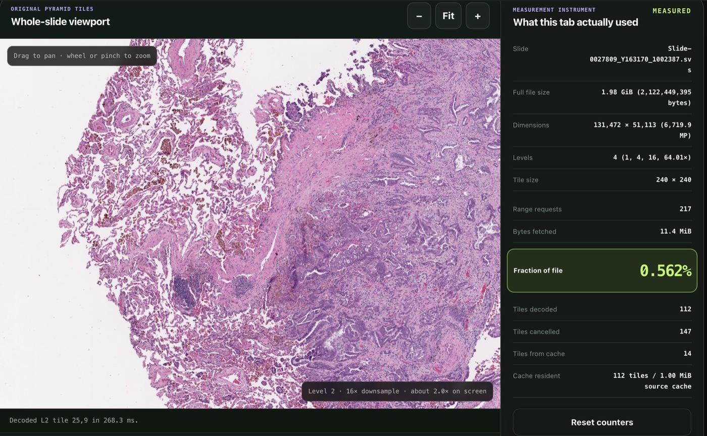
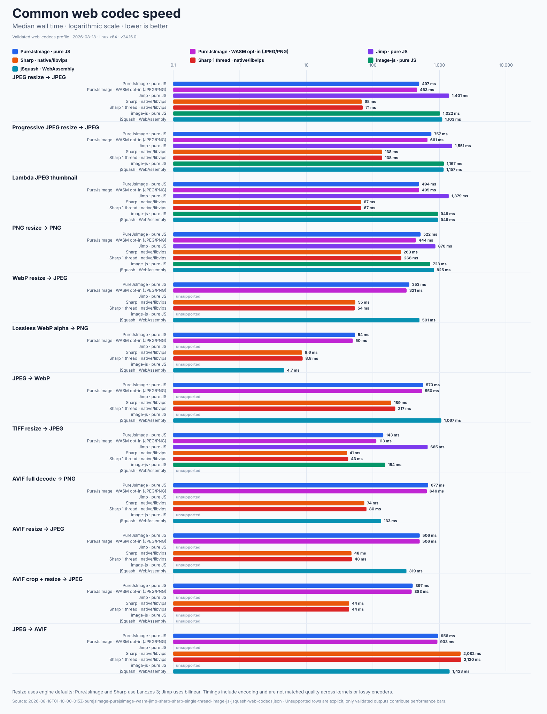
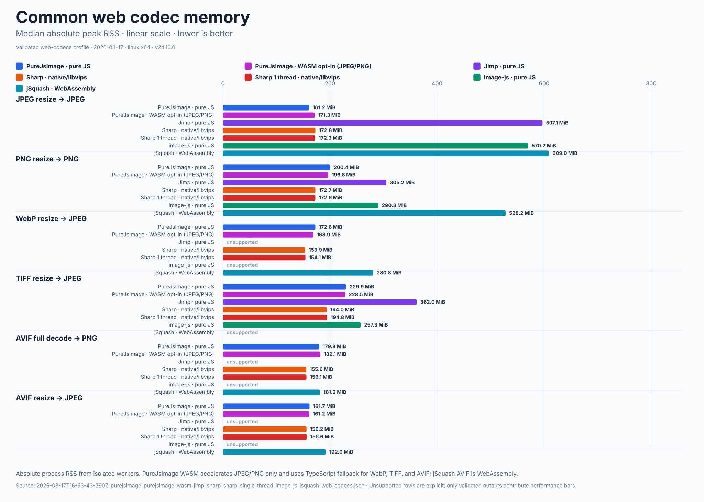

<div align="center">


<h1>PureJsImage</h1>

<p><strong>Zero-runtime-dependency image processing in strict TypeScript</strong></p>

<p>Images, scientific data and geographic rasters · optional WASM acceleration</p>

<p>
  <a href="https://www.npmjs.com/package/purejsimage"></a>
  <a href="https://github.com/a-r-d/PureJsImage/actions/workflows/ci.yml"></a>
  <a href="https://github.com/a-r-d/PureJsImage/blob/main/package.json"></a>
  <a href="https://github.com/a-r-d/PureJsImage/blob/main/LICENSE"></a>
</p>

<p>
  <a href="https://purejsimage.com/">Documentation</a> ·
  <a href="https://purejsimage.com/demo/"><strong>Image demo</strong></a> ·
  <a href="https://purejsimage.com/scientific/"><strong>Scientific explorer</strong></a> ·
  <a href="https://purejsimage.com/4d-stem/"><strong>4D-STEM explorer</strong></a> ·
  <a href="https://purejsimage.com/wsi/"><strong>Whole-slide demo</strong></a> ·
  <a href="https://purejsimage.com/ome-zarr/"><strong>OME-Zarr demo</strong></a> ·
  <a href="https://purejsimage.com/xray/"><strong>Raster X-Ray</strong></a> ·
  <a href="https://purejsimage.com/hdr-surgery/"><strong>HDR Surgery</strong></a> ·
  <a href="https://lab.purejsimage.com/"><strong>PureJsImage Lab</strong></a>
</p>

<blockquote>Sometimes the wrong tool for the job is the right one 😉</blockquote>

<p><a href="https://ard.ninja/blog/2026-08-20-why-i-started-building-purejsimage/">Why I started building PureJsImage</a></p>
</div>

Whole-slide viewing reads the tiles needed for a viewport where the source supports selective
access. The screenshot records one session, not a promise that every operation reads the same fraction.

<p align="center">
  <a href="https://purejsimage.com/wsi/">
    
  </a>
</p>
<p align="center"><em>Measured HTTP Range session from the live browser viewer: only the visible pyramid tiles were read.</em></p>

## Choose the API for your data

PureJsImage opens, inspects, transforms and writes images in Node.js and modern browsers.
Its first-party TypeScript codecs have no runtime dependency tree, native addon or system executable.
It is useful when the same image workflow needs to run in a browser and on a server, or when
source-sized RGBA buffers make a JavaScript pipeline too expensive in AWS Lambda.

- **Lower memory use:** process rows, strips, tiles or regions when the format allows it. Some
  operations need a full image or saved coefficients; those limits are documented.
- **Clear errors:** unsupported files and options fail with an explanation. Benchmarks check
  that the output is correct before reporting speed.
- **Optional acceleration:** add JPEG, PNG or WebP WASM accelerators when they help your application.
  You import and register them yourself; the default TypeScript path never loads them.

| API | Use it for | What to know |
| --- | --- | --- |
| [Image codecs and processing](#ordinary-image-pipeline) | Open, orient, crop, resize, convert and encode | Read and write support vary by codec. Ordinary images can also have high-precision samples. |
| [Scientific datasets](#scientific-datasets) | Original numeric samples, axes, channels, calibration, spectra, planes and volumes | A reader does not imply a writer or every instrument/container variant. You choose how numbers become display colors. |
| [Geographic rasters](#geographic-rasters) | Spatial reference, georeferencing, dimensions, regions, overviews and supported reprojection | Uses the supported raster readers. Check the format’s region and projection support. |

A TIFF can be an ordinary image, a scientific dataset or a geographic raster depending on its data
and the API you use. These areas overlap; their format counts are not additive. JPEG XL's
native-channel API does not register it as a scientific reader, and recognizing a container does
not imply support for every schema it can hold.

[Install](#install) · [JPEG XL tools](#jpeg-xl) · [Format tables](#supported-formats) ·
[Package size](#package-sizes) · [Benchmarks](#current-benchmark-snapshots) ·
[Development](#development)

## Supported formats

<!-- capabilities:readme:start -->
All formats below have a TypeScript implementation. WASM is optional and covers only the listed work; other supported operations use TypeScript. Click a format for its full support list.

### Stable ordinary codecs

| Format | Read | Write | Optional WASM | What’s supported |
| --- | --- | --- | --- | --- |
| [JPEG](jpeg-codec-support.md) | Yes | Yes | [Baseline read/write](https://purejsimage.com/api/#wasm-acceleration) | 8-bit baseline and progressive; grayscale, RGB and CMYK. Gain maps use the HDR API. |
| [PNG](png-codec-support.md) | Yes | Yes | [8-bit read/write](https://purejsimage.com/api/#wasm-acceleration) | 1–16-bit decode; 8/16-bit grayscale, RGB and RGBA output. No APNG frame decode. |
| [WebP](webp-codec-support.md) | Yes | Yes | [Pixel/transform steps](https://purejsimage.com/api/#wasm-acceleration) | Static lossy, lossless and near-lossless output; alpha supported. No animation. |
| [BMP](bmp-codec-support.md) | Yes | Yes | No | Common Windows/OS2 and palette/RLE inputs; 24-bit RGB or 32-bit RGBA output. |
| [TIFF](tiff-codec-support.md) | Yes | Yes | No | Classic TIFF/BigTIFF, strips, tiles and pages. Scientific, OME and whole-slide APIs are separate. |
| [GIF](gif-codec-support.md) | Static / explicit frame 0 | No | No | Static images; animated files require frame 0 selection. No GIF output. |
| [ICO](ico-codec-support.md) | Yes | No | No | One selected PNG or DIB icon; transparency supported. No CUR or ICO output. |
| [JPEG 2000 / JP2](jpeg2000-codec-support.md) | Yes | No | No | Static Part 1 JP2, 1–16-bit samples. No HTJ2K, JPX or encoding. |
| [AVIF](avif-codec-support.md) | Yes | Limited | No | Common 8/10/12-bit stills and alpha. Writer is limited to opaque 8-bit YUV420; no general animation. |
| [JPEG XL](jpegxl-codec-support.md) | Stable common static | Stable lossless, static lossy and exact transcode | No | Lossless/static lossy, exact JPEG recovery, high-depth samples and separate animation APIs. Lossy animation is Experimental. |
| [Radiance HDR / RGBE](hdr-codec-support.md) | Yes | Yes | No | RGBE decode to float32 RGB and RGBE output. No XYZE. |
| [QOI](qoi-codec-support.md) | Yes | Yes | No | QOI v1 RGB/RGBA still images. |
| [Netpbm and PFM](netpbm-codec-support.md) | Yes | Yes | No | PBM, PGM, PPM, PAM and float32 PFM; one image per file. |
| [TGA / TARGA](tga-codec-support.md) | Yes | Yes | No | Palette, grayscale and RGB/RGBA inputs, including RLE; RGB/RGBA output. |

### Experimental codecs

| Format | Read | Write | Optional WASM | What’s supported |
| --- | --- | --- | --- | --- |
| [HEIF / HEIC (experimental)](heif-codec-support.md) | Experimental | No | No | Opt-in HEVC and uncompressed still subsets, including alpha and grids. Patent notice below. |

“Limited” means only the documented subset is supported. Experimental codecs need a separate import and are excluded from `allCodecs`.

WASM does not cover every file the TypeScript codec can read. JPEG acceleration handles common baseline images; PNG handles common non-interlaced 8-bit images; WebP accelerates selected color and transform steps. [Setup, supported cases and fallback behavior](https://purejsimage.com/api/#wasm-acceleration).

[See the exact codec support matrix →](https://purejsimage.com/codecs/)

<details>
<summary>Full support lists for each format</summary>

[JPEG](https://github.com/a-r-d/PureJsImage/blob/main/jpeg-codec-support.md),
[PNG](https://github.com/a-r-d/PureJsImage/blob/main/png-codec-support.md),
[WebP](https://github.com/a-r-d/PureJsImage/blob/main/webp-codec-support.md),
[BMP](https://github.com/a-r-d/PureJsImage/blob/main/bmp-codec-support.md),
[TIFF](https://github.com/a-r-d/PureJsImage/blob/main/tiff-codec-support.md),
[GIF](https://github.com/a-r-d/PureJsImage/blob/main/gif-codec-support.md),
[ICO](https://github.com/a-r-d/PureJsImage/blob/main/ico-codec-support.md),
[JPEG 2000 / JP2](https://github.com/a-r-d/PureJsImage/blob/main/jpeg2000-codec-support.md),
[AVIF](https://github.com/a-r-d/PureJsImage/blob/main/avif-codec-support.md),
[JPEG XL](https://github.com/a-r-d/PureJsImage/blob/main/jpegxl-codec-support.md),
[Radiance HDR / RGBE](https://github.com/a-r-d/PureJsImage/blob/main/hdr-codec-support.md),
[QOI](https://github.com/a-r-d/PureJsImage/blob/main/qoi-codec-support.md),
[Netpbm and PFM](https://github.com/a-r-d/PureJsImage/blob/main/netpbm-codec-support.md),
[TGA / TARGA](https://github.com/a-r-d/PureJsImage/blob/main/tga-codec-support.md),
and [HEIF / HEIC (experimental)](https://github.com/a-r-d/PureJsImage/blob/main/heif-codec-support.md).

</details>
<!-- capabilities:readme:end -->

<!-- documentation:speed-guide:start -->
<!-- Generated by scripts/render-documentation.ts. Do not edit this block. -->
### How fast is it?

These examples time the whole decode, resize and encode operation. Median time in milliseconds; lower is faster. WASM does not improve every operation.

| Example operation | TypeScript | With optional WASM |
| --- | ---: | ---: |
| 12 MP JPEG → 1200 px wide JPEG (quality 80) | 518 ms | 474 ms |
| 12 MP RGBA PNG → 1000 px wide PNG | 398 ms | 435 ms |
| 3.2 MP WebP → 800 px wide JPEG (quality 80) | 345 ms | 314 ms |

Recorded 2026-08-24 with PureJsImage 0.16.0 (workspace), Node v24.16.0, Linux 6.17.0-41-generic/x64, Intel(R) Core(TM) i7-10700 CPU @ 2.90GHz. These are Node results; browser and device speeds differ. The WASM configuration can also use TypeScript for steps without an accelerator.

[Full report, settings and results for other libraries](benchmark/results/public/web-codecs-2026-08-24T20-51-40-120Z.json). Other formats have different costs; see the [benchmark charts](#current-benchmark-snapshots) for more operations.
<!-- documentation:speed-guide:end -->

## Install

```sh
npm install purejsimage
```

PureJsImage requires Node.js 22 or newer. Browser applications import the core API from
`purejsimage/browser`. Public APIs are pre-1.0 and may still receive breaking refinements.

## Ordinary image pipeline

This Node.js example reads a JPEG, applies its orientation, resizes it and writes a JPEG.
Register only the codecs an application needs:

```ts
import { createImageLibrary } from "purejsimage";
import { jpegCodec } from "purejsimage/codecs/jpeg";
import { pngCodec } from "purejsimage/codecs/png";

const images = createImageLibrary({ codecs: [jpegCodec, pngCodec] });
const image = await images.open("input.jpg");

await image
  .autoOrient()
  .resize({ width: 1200, withoutEnlargement: true })
  .jpeg({ quality: 80, background: "#ffffff" })
  .toFile("output.jpg");
```

### In a browser

Import the core from `purejsimage/browser`. Use `File`, `Blob`, `ArrayBuffer`, `Uint8Array` or an
explicit `ImageSource` as input. A browser cannot open a local path string or call `toFile()`;
return a `Blob` or bytes instead. This example uses the prebuilt JPEG, PNG, WebP and AVIF group:

```ts
import { createImageLibrary } from "purejsimage/browser";
import { allWebCodecs } from "purejsimage/codecs/web";

const webImages = createImageLibrary(allWebCodecs);

export async function resizeUpload(file: File): Promise<Blob> {
  const image = await webImages.open(file);
  return image.autoOrient().resize({ width: 1200, withoutEnlargement: true }).png().toBlob();
}
```

Run expensive codec operations in a worker to keep the page responsive. The
[image demo](https://purejsimage.com/demo/) uses the same public pipeline.

TIFF remains an explicit `purejsimage/codecs/tiff` import because including it would substantially
increase the web-focused bundle. Use `purejsimage/codecs/all` when you need every stable codec. See the [API reference](https://purejsimage.com/api/) for
inputs, outputs and limits, and the [native precision guide](docs/native-precision.md) for supported
high-depth transforms, color handling and explicit sample conversion.

### Memory and optional temporary storage

Node orientation and rotation use lazy chunked memory by default. They do not open temporary files.
This default is portable and was 20–28% faster than file storage across the measured orientation
and arbitrary-rotation cases.

Applications can opt into temporary files when reducing Node process RSS matters more than runtime
or filesystem portability:

```ts
const images = createImageLibrary([jpegCodec, pngCodec], { temporaryFiles: true });
```

The opt-in path stores about one padded decoded frame under `os.tmpdir()`. In the measured
4000x3000 RGBA orientation case, file storage reduced peak process RSS from 147.69 MiB to 90.90 MiB
and increased median runtime from 654.72 ms to 820.48 ms. A `tmpfs` still consumes host memory even
though its pages are outside process RSS. PureJsImage probes file creation, writing, reading, and
truncation before consuming image rows. Failed setup or later file writes, including `ENOSPC`, move
the spool to chunked memory and preserve output. An error that prevents recovery of bytes already
written to the file is reported as a structured `ImageError`.

## Gain-map HDR images

Use the separate `purejsimage/hdr` entry for Ultra HDR and ISO 21496-1 gain-map JPEG or AVIF
workflows. Ordinary JPEG decode continues to return the SDR primary.

```ts
import { openGainMapImage } from "purejsimage/hdr";

const image = await openGainMapImage(input);
try {
  for await (const block of image.render({ displayBoost: 4 })) {
    consumeLinearHdrBlock(block);
  }

  const output = await image
    .crop({ x: 100, y: 50, width: 1200, height: 800 })
    .resize({ width: 600, height: 400, kernel: "lanczos3" })
    .jpeg({ metadataMode: "dual", baseQuality: 90, gainMapQuality: 92 });
} finally {
  image.close();
}
```

The renderer returns independently owned linear `rgbf32` or `rgbaf32` row blocks and preserves
values above SDR white. Transformed rendering keeps the decoded and transformed 8-bit component
rasters inside one shared memory limit chosen by the caller. It does not allocate a complete
adapted Float32 image. JPEG gain-map input is limited to an SDR primary. Re-encoded JPEG primaries
carry PureJsImage's deterministic sRGB ICC profile. The first gain-map AVIF writer is limited to an
opaque sRGB SDR base and one-channel gain map. See the [gain-map HDR guide](docs/hdr-surgery.md) and the local
[HDR Surgery browser workbench](https://purejsimage.com/hdr-surgery/).

## JPEG XL

> The six new tool pages below are included in this repository’s docs build. Their public URLs
> will become available when that build is deployed.

Try the [JPEG XL encoder and decoder hub](https://purejsimage.com/jpeg-xl/),
[converter](https://purejsimage.com/jpeg-xl/convert/) or
[exact JPEG round-trip tool](https://purejsimage.com/jpeg-xl/jpeg-recompression/).
Static lossy encoding is Stable for the documented integer subset; lossless remains the default.
[Lossy animation](https://purejsimage.com/jpeg-xl/animation/) remains Experimental.

Pixel-lossless encoding preserves supported sample values. Exact JPEG recompression preserves the
eligible original JPEG bytes, including reconstruction data. Native sample preservation is
separate from a resized or display-mapped export. Explore those differences in the
[native inspector](https://purejsimage.com/jpeg-xl/native/) and the
[progressive/region explorer](https://purejsimage.com/jpeg-xl/progressive/).

The [JavaScript comparison](https://purejsimage.com/jpeg-xl/comparison/) reports measured quality,
size, speed and API boundaries for PureJsImage, jSquash, jxl-oxide-wasm and wasm-vips. It retains
failures and incomplete comparisons, along with each library’s strengths.
The tools use the repository build, which can be ahead of npm; the comparison names its tested
revision. See the [API and precision guide](docs/jpeg-xl.md) and
[comparison methods and results](benchmark/jpegxl/comparison/REPORT.md).

## Viewing large images

[Raster X-Ray](https://purejsimage.com/xray/) connects an output block or tile to its recorded
reads and file ranges. Use it to see which parts of a large source an operation reads.

[Whole-slide demo](https://purejsimage.com/wsi/) · [OME-Zarr demo](https://purejsimage.com/ome-zarr/) ·
[How Raster X-Ray tracks reads](docs/execution-evidence.md) · [Tile memory model](docs/contracts/tile-memory-model.md)

## Scientific datasets

Scientific readers preserve labeled axes, calibration, native sample types, and the ability to read
only the parts you need. Numeric data becomes display pixels only when an application explicitly
chooses a range, palette, slice, or projection.

```ts
import { FileSource } from "purejsimage";
import { createScientificLibrary } from "purejsimage/scientific";
import { omeTiffReader } from "purejsimage/scientific/readers/ome-tiff";

const science = createScientificLibrary({ readers: [omeTiffReader] });
const document = await science.open({
  primary: {
    id: "input",
    name: "input.ome.tif",
    source: await FileSource.open("input.ome.tif"),
  },
});
try {
  const first = document.datasets[0];
  if (!first) throw new Error("No scientific dataset found");
  const dataset = await document.openDataset(first.id);
  console.log(dataset.descriptor.axes); // Choose axes before reading a plane or region.
} finally {
  await document.close?.();
}
```

In a browser, keep the same scientific library and reader imports. Replace the Node `FileSource`
with a `BlobSource` from `purejsimage/browser`, or use the file/companion helpers in
`purejsimage/scientific/browser`. Files with sidecars need those companion resources too.
See the [browser resource guide](docs/scientific-reader-registry.md).

Direct-range readers can request only the source spans needed for metadata, a native-precision
region, a spectrum, a volume plane, or a whole-slide tile. This includes workflows across DM3 and
DM4, TIA SER and EMI, NCEM and Velox EMD, NIfTI, NRRD, MRC, OME-TIFF, Aperio SVS, AFM and surface
metrology, and 4D-STEM data.

[Scientific format reference →](https://purejsimage.com/scientific-formats/) ·
[Scientific API reference →](https://purejsimage.com/api/#scientific) ·
[Scientific application guide →](docs/application-platform.md) ·
[OME-Zarr reader and validation policy →](docs/scientific-ome-zarr.md) ·
[OME-Zarr compatibility results →](docs/generated/ome-zarr-compatibility.md) ·
[Reading numeric tiles →](docs/scientific-numeric-tiles.md) ·
[Bounded raster analysis →](docs/bounded-raster-analysis.md)

## Geographic rasters

Use `purejsimage/geo` with explicit readers from `purejsimage/geo/readers` when coordinates and
spatial reference are part of the operation. Displaying a TIFF through the ordinary pipeline does
not by itself apply its georeferencing or reproject it.

Ordinary GeoTIFFs opened through `tiffReader` expose a typed
`dataset.descriptor.spatialReference` with CRS identity/citation, pixel-to-model affine, inverse
when invertible, model bounds, pixel interpretation, nodata, and GeoTIFF source metadata.
`readPlane()` regions remain raster pixel coordinates.

For Cloud Optimized GeoTIFF workflows, `inspectCog()` reports container, IFD/SubIFD, tile,
overview, compression, and sample layout plus likely structural issues. The checked
[COG compatibility matrix](docs/tiff-cog-compatibility.md) distinguishes display-only compression
from native scientific-raster support and includes the simulated-range viewport benchmark.

GeoTIFF and GeoZarr are also available as lazy `GeoRasterDataset` readers under
`purejsimage/geo/readers`. The GeoZarr reader supports v2 and v3 metadata, regular chunks, supported
v3 shards, multiscales, HTTP stores, local directories, and ZIP stores without adding another Zarr
decoder. Band, time, vertical, ensemble, and custom dimensions remain selectable axes.
World-file TIFF, JPEG, and PNG images, georeferenced ENVI, Esri ASCII Grid, and SRTM HGT use the same
geo API, with region-read support that depends on the format.
Classic NetCDF CDF-1 and CDF-2 files with regular rectilinear CF coordinates are available through
`purejsimage/geo/readers/netcdf`. Time and vertical dimensions remain selectable. CDF-5,
HDF5-backed NetCDF4, irregular coordinate lookup, and curvilinear grids are reported explicitly.

<!-- geo-capabilities:readme:start -->
<!-- Generated from capabilities/geo-manifest.json. Do not edit directly. -->
### Geographic raster compatibility

| Format | Local | Remote | Region | Multiscale | Reprojection | Write |
| --- | --- | --- | --- | --- | --- | --- |
| GeoTIFF | Tested | Tested | Tested | Tested | Tested | Out of scope |
| COG behavior | Tested | Tested | Tested | Tested | Tested | Out of scope |
| GeoZarr | Tested | Tested | Tested | Tested | Tested | Out of scope |
| Image plus world file | Tested | Tested | Fixture-limited | Unavailable | Tested | Out of scope |
| ENVI | Tested | Fixture-limited | Tested | Unavailable | Tested | Out of scope |
| Esri ASCII Grid | Tested | Fixture-limited | Fixture-limited | Unavailable | Fixture-limited | Out of scope |
| SRTM HGT | Tested | Fixture-limited | Tested | Unavailable | Tested | Out of scope |
| Classic NetCDF / CF | Tested | Tested | Tested | Unavailable | Fixture-limited | Out of scope |

“Fixture-limited” is implemented behavior with a narrow current corpus. “Metadata only” does not
claim the related pixel operation. See the [full geographic support table](docs/generated/geo-compatibility.md)
and the [machine-readable manifest](docs-astro/public/geo-capabilities.json).
<!-- geo-capabilities:readme:end -->

[Geo raster architecture →](docs/geo-architecture.md) ·
[GeoZarr reader →](docs/geozarr-reader.md) ·
[Contained geo formats →](docs/geo-contained-formats.md) ·
[Classic NetCDF and CF grids →](docs/netcdf-cf.md)


<!-- package-metrics:scientific-readers:start -->
<!-- Generated by scripts/render-package-metrics.ts. Do not edit this block. -->
<a id="scientific-reader-package-surface"></a>

### Scientific readers

Import the **33 scientific readers** from `purejsimage/scientific/readers/*` or choose a group below. Counts come from the reader manifest and package exports.

| Reader family | Count | Representative formats |
| --- | ---: | --- |
| [Common raster and whole-slide](https://purejsimage.com/scientific-formats/#common-raster-whole-slide) | 9 | PNG, JPEG, WebP, BMP, JPEG 2000 / JP2, TIFF, OME-TIFF, OME-Zarr, Aperio SVS |
| [Electron microscopy](https://purejsimage.com/scientific-formats/#electron-microscopy) | 7 | Gatan DigitalMicrograph, FEI/Thermo TIA SER, FEI/Thermo TIA EMI, NCEM EMD 0.2, FEI/Thermo Velox EMD, NanoMegas ASTAR blockfile, Quantum Detectors Merlin MIB |
| [AFM, SPM, and surface metrology](https://purejsimage.com/scientific-formats/#afm-spm-surface-metrology) | 5 | Gwyddion Simple Field, Nanonis SXM, Igor Binary Wave v5, Digital Surf SUR/PRO, X3P surface exchange |
| [Medical and volume interchange](https://purejsimage.com/scientific-formats/#medical-volume-interchange) | 5 | MRC/CCP4, NRRD, MetaImage MHD/MHA, NIfTI-1/2, DICOM Part 10 Image |
| [Spectroscopy and detector interchange](https://purejsimage.com/scientific-formats/#spectroscopy-detector-interchange) | 6 | ENVI, FITS, CBF/imgCIF, Lispix RPL/RAW, EMSA/MAS spectrum, ANG/CTF orientation map |
| [Raw numeric interchange](https://purejsimage.com/scientific-formats/#raw-numeric-interchange) | 1 | NumPy NPY |

Find imports and supported variants in the [scientific format reference](https://purejsimage.com/scientific-formats/), the [API reference](https://purejsimage.com/api/#scientific), and the machine-readable [capability manifest](capabilities/manifest.json).

The browser explorer includes sample files for Gwyddion Simple Field (`purejsimage/scientific/readers/gsf`), ENVI (`purejsimage/scientific/readers/envi`), FITS (`purejsimage/scientific/readers/fits`), MRC/CCP4 (`purejsimage/scientific/readers/mrc`), CBF/imgCIF (`purejsimage/scientific/readers/cbf`). For other files, its generic tab uses the filename and media type to select likely readers, then checks a limited number of bytes to confirm the format. You can also select a reader yourself.
<!-- package-metrics:scientific-readers:end -->

Experimental HEIF/HEIC is available only from `purejsimage/codecs/experimental/heic`. It remains
excluded from `allCodecs` because HEIC commonly carries HEVC/H.265 content that may be subject to
third-party patent rights. The project’s MIT license grants no third-party patent rights; users and
distributors must evaluate their own licensing obligations.

<!-- documentation:benchmarks:start -->
<!-- Generated by scripts/render-documentation.ts. Do not edit this block. -->
## Current benchmark snapshots

**Web codec benchmarks (2026-08-24):** 122 passing cases, 25 unsupported cases, and no invalid outputs or errors across JPEG, PNG, WebP, TIFF, and AVIF workflows. On the 24-megapixel photo pipeline, the TypeScript path used 84.7% less absolute peak RSS than Jimp (181.8 MiB versus 1189.1 MiB).

**Scientific readers (2026-08-17):** 43 correctness and startup checks passed across 31 readers in that snapshot. Separate tests of medium and large datasets checked 13 representative workloads; 6 had a coefficient of variation below 10%; the rest are marked noisy in the report. Results include time to first data, operation time, peak memory, requests and bytes read, extra data fetched, startup time and output checks.

> Ordinary and scientific reports use separately fingerprinted harnesses. No cross-section speed or memory ratio is claimed.

<p align="center">
  <a href="https://purejsimage.com/performance/#web-codec-benchmarks">
    
  </a>
</p>
<p align="center"><em>Median wall time in milliseconds; lower is better. Native Sharp/libvips results are not WASM measurements.</em></p>

<p align="center">
  <a href="https://purejsimage.com/performance/#web-codec-benchmarks">
    
  </a>
</p>
<p align="center"><em>Absolute process peak RSS in MiB; lower is better. This includes runtime overhead, not just codec-managed buffers.</em></p>

[Web codec benchmarks](https://purejsimage.com/performance/#web-codec-benchmarks) · [Scientific methodology and report](https://purejsimage.com/performance/#scientific-readers) · [Benchmark harness](benchmark/README.md) · [Generated result index](benchmark/results/public/index.json)
<!-- documentation:benchmarks:end -->

Historical AWS Lambda measurements remain useful for memory-tier and CPU-allocation context, but are
kept separate from current local benchmark headlines. See the
[performance page](https://purejsimage.com/performance/#lambda) for dates, architecture, and exact
artifacts.

<!-- documentation:summary:start -->
<!-- Generated by scripts/render-documentation.ts. Do not edit this block. -->
<a id="current-package-surface"></a>

## Package sizes

Generated from the repository manifests and recorded package metrics (package version 0.17.0). A repository checkout can include APIs newer than the published package.

**14 stable ordinary codecs** and **1 experimental codec** are listed in the [format tables](#supported-formats). Read/write subsets remain separate.

**33 scientific readers** are grouped in the [reader table](#scientific-reader-package-surface). This count includes ordinary image adapters; it is not an additional count of unique file formats.

| Bundle | Minified JS | gzip | Brotli |
| --- | ---: | ---: | ---: |
| Core API | 19.5 KiB | 6.6 KiB | 6.0 KiB |
| Common web codecs | 652.9 KiB | 239.2 KiB | 198.6 KiB |
| All stable codecs | 1337.8 KiB | 462.6 KiB | 373.1 KiB |
| Scientific platform | 197.5 KiB | 56.3 KiB | 47.4 KiB |
| All scientific readers | 1244.1 KiB | 359.9 KiB | 287.1 KiB |
| Geo raster platform | 138.1 KiB | 37.5 KiB | 32.0 KiB |
| All Geo readers | 626.3 KiB | 189.6 KiB | 153.5 KiB |

The extracted npm package is 8.3 MiB with 1 production package, including PureJsImage itself. This is unpacked size, not the compressed npm tarball.
<!-- documentation:summary:end -->

<!-- package-metrics:bundle:start -->
<!-- Generated by scripts/render-package-metrics.ts. Do not edit this block. -->
### Bundle size and npm package size

Generated for purejsimage 0.17.0. Use these imports to select an entry point; the table above also includes the geographic API and readers. Per-codec, per-reader, competitor, installed-package and WASM measurements are linked below.

| Bundle | Import | Minified JS | gzip | Brotli |
| --- | --- | ---: | ---: | ---: |
| Core API initial chunk | `purejsimage` | 19.5 KiB | 6.6 KiB | 6.0 KiB |
| Core + common web codecs | `purejsimage/codecs/web` | 652.9 KiB | 239.2 KiB | 198.6 KiB |
| Core + all stable codecs | `purejsimage/codecs/all` | 1337.8 KiB | 462.6 KiB | 373.1 KiB |
| Core + scientific platform | `purejsimage/scientific` | 197.5 KiB | 56.3 KiB | 47.4 KiB |
| Scientific readers: all | `purejsimage/scientific/readers/all` | 1244.1 KiB | 359.9 KiB | 287.1 KiB |

The 8 optional JPEG, PNG, and WebP accelerator assets total 175.7 KiB raw WASM and are loaded only through explicit accelerator imports. See the unpacked package total above; these assets are separate from the JavaScript transfer sizes.

[Complete size and footprint tables →](https://purejsimage.com/performance/#package-footprint) · [Machine-readable package metrics](benchmark/generated/package-metrics.json)
<!-- package-metrics:bundle:end -->

## Tests and benchmark methods

- [How Raster X-Ray tracks reads](docs/execution-evidence.md)
- [Benchmark methodology and current charts](https://purejsimage.com/performance/)
- [Date-stamped benchmark results and indexes](benchmark/results/)
- [Machine-readable package metrics](benchmark/generated/package-metrics.json)
- [Capability manifest](capabilities/manifest.json)
- [Pinned benchmark corpus](benchmark/corpus/manifest.json)
- [Detailed benchmark harness guide](benchmark/README.md)

<!-- library-comparison:readme:start -->
<!-- Generated by scripts/render-library-comparison.ts. Do not edit this block. -->
### Historical TIFF conformance comparison

The checked 2026-08-13 snapshot compared documented TIFF capabilities separately from independent RGBA output. PureJsImage decoded 104/106 comparable display cases; 57 were exact and 47 had pixel differences. “Oracle unavailable” means the independent Sharp/ImageMagick path could not produce ground truth, not that an engine failed. Current performance headlines come from the newer generated benchmark index above.

[Full grouped capability matrix, methods, sources, and per-library results](https://purejsimage.com/tiff-comparison/)
<!-- library-comparison:readme:end -->

### When to use another library

If you can install native libvips and mainly need high throughput, consider
[Sharp](https://sharp.pixelplumbing.com/). PureJsImage is useful when you need the same code in Node and a browser, original scientific
samples, or image processing without installing a native library.

## Citation

[](https://doi.org/10.5281/zenodo.22071814)

Use the metadata in [`CITATION.cff`](CITATION.cff) to cite PureJsImage. The file records the current
software release, author, source repository, npm package, license, and project keywords in Citation
File Format 1.2.0. The DOI for release 0.16.0 is
[`10.5281/zenodo.22071815`](https://doi.org/10.5281/zenodo.22071815). Use
[`10.5281/zenodo.22071814`](https://doi.org/10.5281/zenodo.22071814) to cite the project across all
versions.

## Development

```sh
npm install
npm run check
```

Read [CONTRIBUTING.md](CONTRIBUTING.md), the [architecture](project-spec.md), and the
[roadmap](ROADMAP.md) before larger changes.

## License

[MIT](LICENSE). The HEIF/HEIC patent notice above is separate from the project license.

## Special thanks

Thanks to [Imazen](https://github.com/imazen) for the real-world image corpus used in compatibility
and (especially) TIFF validation.

Thanks to [PgRust](https://malisper.me/how-we-made-postgres-hundreds-of-times-faster-the-query-engine/) for inspiring me to do this work.
